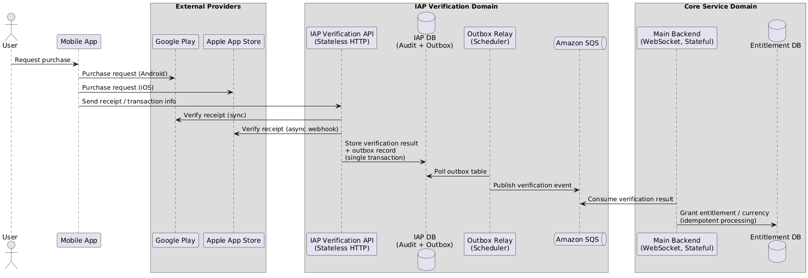

## Context & Constraints
Almigo(알미고)는 0 -> 1의 대화형 AI 디지털휴먼 앱으로 실시간 채팅 경험을 제공한다.
메인 백엔드 서버는 Stateful한 Websocket 기반인 반면, IAP 검증 기능은 Stateless한 HTTP 기반으로 External provider(Google/Apple)가 제공한다.

### 핵심 제한사항
1. 코어 서비스는 long-lived Websocket session을 유지한다.
2. IAP 검증은 모바일 앱에 의해 트리거 되며 HTTP를 사용한다.
3. Google의 검증은 동기 방식인 반면, Apple 검증은 Webhook 기반의 비동기 방식이다.
4. 결제 검증 결과는 서버가 운영중이지 않을 때에도 유실되어서는 안된다.
5. 사후 감사를 위해 결제 이력이 저장되어야 한다.

즉, 결제 검증 프로세스의 신뢰성을 강화하는 한 편 Websocket lifecylce과의 decoupling을 중심으로 결제 검증 결과를 전달해야한다.
## Design Options Considered & Decision
### 검증 서버 분리
**Option A: IAP 검증을 메인 웹소켓 백엔드에서 처리**
- Pros: 아키텍처 간단, 유지보수 용이
- Cons: Stateful 서버 재시작 시 External Provider로부터 수신하는 검증 결과가 유실될 가능성
**Option B (선택): IAP 검증 서비스를 별도 서버로 분리**
- Pros: Stateful한 Websocket lifecycle로부터 결제 검증 절차를 분리
- Cons: 운영 복잡도 증가
### 메인 백엔드 서버로 검증 결과 전달 방법
**Option A: 동기 방식**
메인 백엔드가 polling하고 검증 결과를 기다린다.
- Cons: External Provider 응답에 의해 blocking. 검증 결과 delivery를 보장할 수 없음.
**Option B (선택): 비동기 방식 (메시징)**
검증 백엔드가 결과를 독립적으로 발행하고 메인 백엔드가 가용할 때 결과를 소비한다.
- Pros: 메인 백엔드 재시작으로 인한 검증 결과 유실 방지
- Cons: Eventual Consistency 방식
### DB 저장과 메시지 전달 간의 원자성 보장
검증 결과를 Audit을 위해 DB에 저장되어야 하며, 메시지브로커 등을 통해 메인 백엔드로 전달되어야 함.
DB 쓰기와 메시지큐 발행을 원자적으로 보장할 수 없음.
**Option A: 2PC**
- Cons: 현대 메시지큐에서 지원 안함. DB와 메시지브로커를 강결합 시킴.
**Option B (선택): Transactional Outbox**
검증 결과를 DB에 저장 > Outbox 레코드를 같은 트랜잭션으로 처리 > relay 프로세스로 메시지 발행 > 메인 백엔드에서 메시지 처리(idempotency 적용 필요)
- DB 쓰기와 메시지 발행 절차를 분리, Eventual Delivery를 채택하여 재시도 용이
## Finalized Architecture

## Trade-Offs & Risks
- 추가 서버 개발과 Outbox relay로 인한 운영 복잡도 증가
- 검증과 권한부여(구매 재화부여 등) 사이의 Eventual Consistency
- 동기방식 프로세스에 비해 실패에 대한 가시성 악화
## Outcome
- 메인 백엔드 서버 재시작과 관계없이 검증 결과 유실 방지
- 메인 백엔드 서버와 결제 서버를 독립적으로 스케일링 가능
## What I'd Change Next Time
- 가시성 향상을 위해 메시지 브로커에 대한 대쉬보드 설정 선행
- E2E 테스트가 가능한 스크립트 제작
