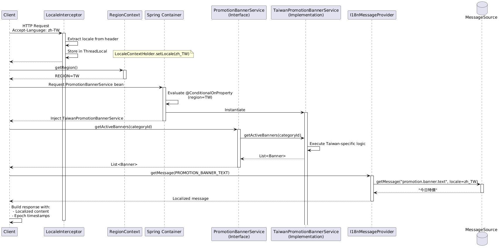

## Overview

한국에서 운영 중인 PLP(Product Landing Page) 서비스를 대만으로 확장하는 프로젝트이다. 단순 복제가 아닌, 향후 글로벌 확장을 고려한 확장 가능한 멀티 리전 아키텍처 설계가 핵심이었다.

### The Problem
신규 리전 확장 시 두 가지 근본적인 선택이 필요하다:
- **완전 분리**: 리전별 독립 코드베이스 운영
- **통합 관리**: 단일 코드베이스로 멀티 리전 지원

각각의 방식은 개발 속도, 유지보수성, 확장성에서 상반된 트레이드오프를 가진다.

### Key Constraints
1. 인프라 팀이 대만용 독립 VPC를 이미 프로비저닝한 상태
2. 국제화 팀이 가격 표시 SDK를 준비한 상태
3. 향후 추가 리전 확장 가능성 (기존에 일본 시장에서 별도 코드베이스로 확장한 사례 존재)
4. 기존 한국 서비스의 무중단 운영 필수
5. 리전별 비즈니스 로직 차이 존재

목표는 **최소한의 기술 부채로 지속 가능한 글로벌 확장 기반을 구축**하는 것이다.

## Design Options & Evaluation

#### Option 1: Separate Codebase per Region
각 리전마다 독립된 코드베이스와 배포 파이프라인을 운영한다.
- **Pros:** 리전별 완전한 독립성과 자율성 확보
- **Cons:** 코드 중복으로 인한 유지보수 비용 2배 증가
#### Option 2 (선택): Unified Codebase with Region Abstraction
단일 코드베이스에서 리전별 설정과 로직을 추상화하여 관리한다.
- **Pros:** 공통 로직 재사용으로 개발 효율성 극대화
- **Cons:** 초기 아키텍처 설계 복잡도 증가 및 각 리전별 철저한 테스트 필수
## The Solution: Region-Aware Unified Architecture
향후 다른 지역으로 리전 확장이 가능함을 고려할 때, Option1은 유지 비용이 선형적으로 증가한다. Option2를 선택하여 초기 투자를 늘리는 대신 한계비용을 낮춘다.
### Architectural Decisions

#### 1. Region as First-Class Configuration
리전을 아키텍처의 핵심 변수로 다룬다.
```
// 배포 시점에 리전 파라미터 주입 
export REGION=TW // or KR, JP 

// 애플리케이션 부트스트랩 시 리전 컨텍스트 초기화 
@Configuration 
public class RegionConfig { 
	@Value("${app.region}") 
	private String region; 

	@Bean public RegionContext regionContext() { 
		return new RegionContext(Region.valueOf(region)); 
	} 
}
```
#### 2. Strategy Pattern with Conditional Beans
리전별 비즈니스 로직 분기를 if-else 난무가 아닌, 명확한 전략 패턴으로 변경한다.
이를 통해, 새로운 리전 추가시 기존 코드를 수정할 필요 없고, 각 리전별 로직을 독립적으로 테스트할 수도 있다.
```
// 인터페이스 정의
public interface PromotionBannerService {
    List<Banner> getActiveBanners(String categoryId);
}

// 리전별 구현체
@Component
@ConditionalOnProperty(name = "app.region", havingValue = "KR")
public class KoreaPromotionBannerService implements PromotionBannerService {
    @Override
    public List<Banner> getActiveBanners(String categoryId) {
        return bannerRepository.findKoreaStyleBanners(categoryId);
    }
}

@Component
@ConditionalOnProperty(name = "app.region", havingValue = "TW")
public class TaiwanPromotionBannerService implements PromotionBannerService {
    @Override
    public List<Banner> getActiveBanners(String categoryId) {
        return bannerRepository.findTaiwanStyleBanners(categoryId);
    }
}

```
#### 3. Temporal Data Normalization
시간대와 날짜 표기의 혼란을 방지하기 위해 Epoch Time을 단일 진실 공급원으로 사용한다. (기존 레거시 코드 마이그레이션을 감수해야한다)
#### 4. Content Internationalization via Accept-Language
한국 거주 대만인, 대만 거주 한국인 등 다양한 사용자 맥락을 서버 설정만으로 처리할 수 없다. 클라이언트가 선호 언어를 명시하는 것이 더 정확하다. 따라서 클라이언트의 Locale을 기준으로 메시지를 동적으로 제공한다.

```java
public enum I18nMessage {
    CATEGORY_TITLE("category.display.title"),
    PROMOTION_BANNER_TEXT("promotion.banner.text"),
    
    private final String code;
    
    I18nMessage(String code) {
        this.code = code;
    }
    
    public String getCode() {
        return code;
    }
}

// messages_ko.properties
category.display.title=추천 상품
promotion.banner.text=오늘만 특가

// messages_zh_TW.properties  
category.display.title=推薦商品
promotion.banner.text=今日特價
```
#### 5. Feature Flags for Experimental Changes
개발 중 불확실한 기능은 리전별로 독립적으로 제어한다.
### Sequence Flow

## Trade-Offs & Risks
1. 초기 개발 복잡도 증가
2. 테스트 매트릭스 증가
    - Impact: 리전별 E2E 테스트 필요
    - Mitigation: Parameterized test로 코드 재사용
3. 리전 간 결합도
    - Impact: 한 리전 변경이 다른 리전 영향 가능
    - Mitigation: 철저한 Feature Flag + Canary 배포
## The Outcome
- 잠재적 리전 확장 속도: 3개월 → 3일
- 코드 중복률: 0%
- 공통 기능이 모든 리전에 동시 적용
## Retrospective
- 리전별 메트릭 분리: 단일 대시보드에서 필터링보다는 리전별 독립 대시보드 필요 (모니터링 즉시성 확보)
- 문서화 강화: 리전별 설정 가이드를 위한 별도 runbook 필요