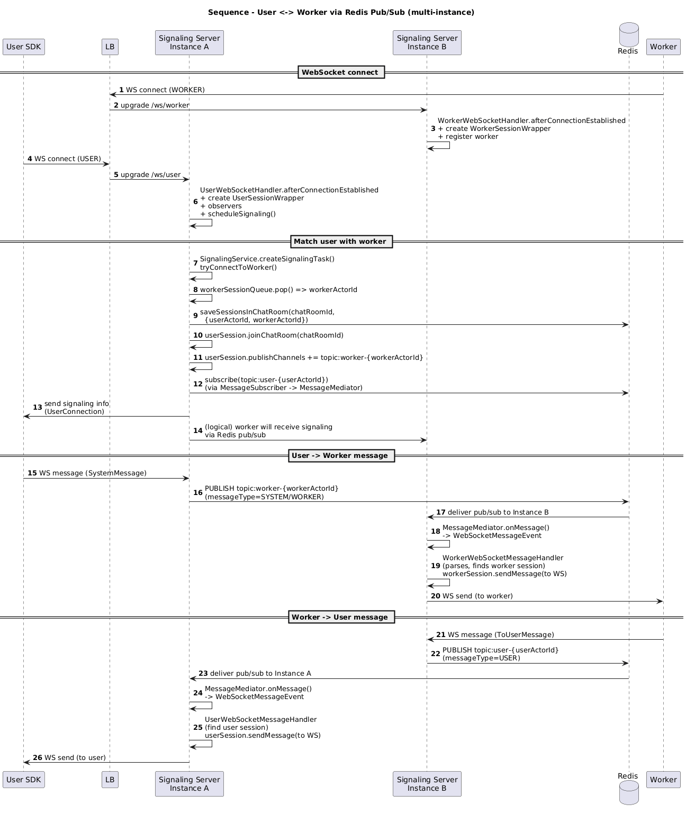

## Context & Constraints
AI 채팅 서비스의 Signaling Server는 WebSocket 기반으로 동작하며, User와 Worker 간의 실시간 메시지 중계 및 각종 비즈니스 로직 등을 위한 시그널 전송을 담당한다. 초기 단일 인스턴스 구조에서는 동시 접속자 증가, 장애 내성 요구를 충족할 수 없어 수평확장을 고려하게 되었고 특히 User와 Worker가 서로 다른 인스턴스에 연결되는 상황을 가정한 설계가 필요했다.
### 핵심 제약사항
1. WebSocket 기반 stateful 서버
2. User / Worker 세션은 특정 인스턴스에 종속
3. 수평 확장을 위해 인스턴스 간 메시지 전달 필요
4. 세션 상태 및 채팅룸 상태의 중앙 관리 필요
## Design Options Considered

### Option 1: Instance-to-Instance Direct Communication
각 Signaling Server 간 직접 통신
- Cons: 인스턴스 수 증가에 따른 토폴로지 관리 부담, Actor모델 이해 필요
### Option 2: Kafka 등 신규 Message Broker 도입
- 높은 확장성과 내구성
- Cons: 운영 복잡도 증가, 사내 Kafka 관련 인프라 없음
### Option 3 (선택): Redis Pub/Sub 기반 Message Broker
- 이미 세션/상태 저장소로 Redis 사용 중
- 인스턴스 간 loose coupling 가능
- Cons: Fire & Forget으로 메시지 리플레이 등 기능 부족
## Decision
Redis Pub/Sub을 활용하여 User와 Worker 각각에 세션 단위의 채널을 할당하고, 메시지를 발행/구독 구조를 채택했다. 각 Signaling Server는 Redis를 통해 메시지를 수신한 뒤, 로컬 WebSocket 세션으로 전달한다.
## Finalized Architecture
- MessageMediator 계층을 통해 Redis 메시지를 내부 이벤트로 변환
- WebSocketMessageHandler는 messageType 기준으로 분기 처리
- ChatRoomJoinedSessions 정보를 Redis에 저장하여 cross-instance routing 가능

## Trade-Offs & Risks
- Redis Pub/Sub은 메시지 영속성을 보장하지 않음
- Subscriber 장애 시 메시지 유실 가능 (메시지 유실 가능성에 대해 PO/PM과 사전 협의)
## Outcome
- 멀티 인스턴스 수평 확장 가능
- User/Worker가 서로 다른 인스턴스에 연결되어도 정상 통신
- 단일 인스턴스 장애 시에도 서비스 지속 가능
## What I’d Improve Next
- Redis Streams 혹은 다른 메시지브로커로 전환 검토 (at-least-once 보장)
- 글로벌 리전 확장을 고려한 Pub/Sub 추상화
