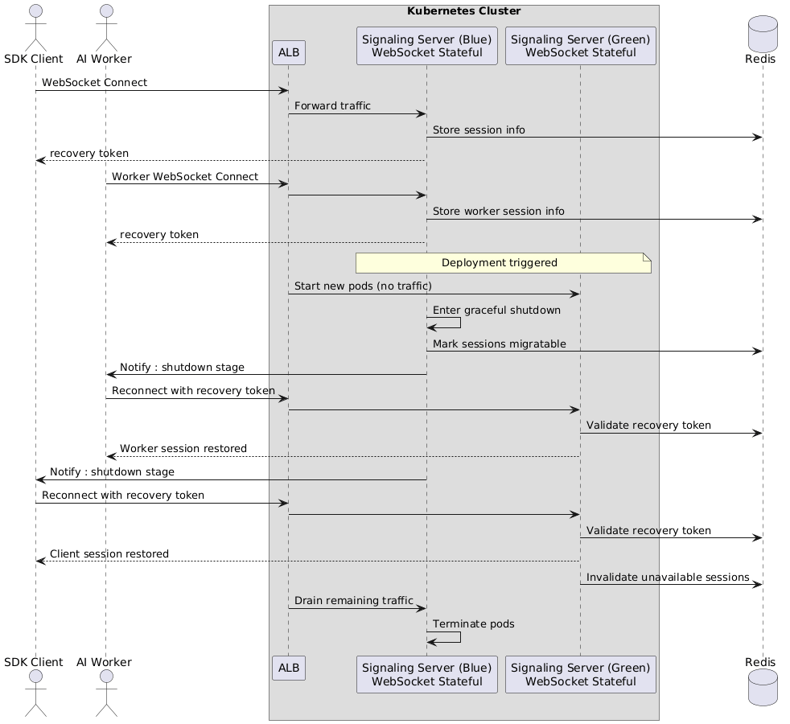

## Overview
The Signaling Server is the backbone of our real-time interaction, managing the lifecycle between SDK clients and AI Workers. It handles everything from text/video triggers to voice message persistence and session metrics.
### The Problem
Our legacy deployment process was "destructive" for stateful connections:
- User Disruption: Every redeployment terminated active WebSocket sessions, killing video streams and wiping local chat histories.
- Recovery Lag: Clients faced a ~20s delay to re-establish connections.
- Operational Risk: Deployments were restricted to 3 AM "low-traffic" windows to minimize user impact, slowing down the development velocity.
### Key Constraints
- Stateful Persistence: Real-time sessions cannot be easily "snapshotted."
- Tight Coupling: Signaling is deeply integrated with Core and Media servers.
- Worker Stickiness: To prevent media breaks, clients must reconnect to the exact same AI Worker they were previously paired with.
- Traffic Management: Risk of "Reconnect Storms" crashing the new pods during rolling updates.

## Design Options & Eevaluation
**Option 1 : Client dual-connection**
- Pros: Easy server implementation.
- Cons: Managing "match discovery" across two connections is too complex for the client.
**Option 2: Stateless reconnect with session recreation by client**
- Pros: Minimal architectural change.
- Cons: User experience is still interrupted during the gap.
**Option 3 (Selected): Recovery Token–Based Session Handover**
- Pros: Guaranteed continuity.
- Cons: High implementation complexity across SDK, Server, and Infra.

## The Solution: Recovery Token-Based Handover 
We transitioned to a Blue-Green Deployment strategy supported by a custom Session Handover protocol.
### Architectural Decisions
1. The Recovery Token: Issued at initial handshake. It contains the session_id and the peer_id (AI Worker). This acts as a "passport" for the client to find its previous state on a new pod.
2. Worker-First Reconnection: We orchestrated AI Workers to reconnect to the New Pods before the SDK clients. This ensures the target is ready when the user arrives.
3. Graceful Handover Signals: Leveraging K8S termination lifecycle, the Old Pod sends a specific `GOAWAY` signal to clients, triggering a coordinated migration rather than a hard crash.
4. Infrastructure Segregation: Used Argo Rollouts to ensure that once a deployment starts, all reconnection traffic is routed exclusively to the Green (New) stack to prevent bouncing between versions.
### Sequence Flow

## **Trade-Offs & Risks**
- Complexity: The protocol sequence is significantly more complicate, increasing the debugging surface area.
- Cross-Domain Dependency: Success relies on synchronized logic across Backend, SDK, AI Worker, and DevOps.
- State Management: Recovery tokens must be strictly managed with TTLs to prevent security exploits or ghost sessions

## The Outcome
The project successfully shifted our operational paradigm from "Fear-Based Deployment" to "Confident Continuous Delivery."
- Reliability: 100% pass rate on Critical Path reconnection scenarios.
- Success Rate: Over 90% reconnection success during active deployments (Session loss < 10%).
- Efficiency: Eliminated the need for 3 AM deployments; the team can now ship code during peak hours without impacting UX.
## Retrospective
- Observability: I plan to implement more granular session-level telemetry to track exactly where the 10% of lost sessions fail.
- Resilience Testing: I intend to introduce Chaos Engineering (specifically targeting the reconnection logic) into our E2E pipeline to simulate edge-case network failures during handovers.
